Project 1 Group 2
================
Ashlyn Sak, Meiers Dixon, Cristoph Klews
7 Oct 2024

## Dinosaurus Data

Hello everyone, the goal of this tutorial is to find the dataset that
plots a dinosaur. Although you are trying to find the dinosaur, the goal
of this tutorial is to meet the following objectives.

1)  Create and interpret effective plots in RStudio
    1)  Create histograms, boxplots, and bellcurves
    2)  Modify axes labels and colors of plots
2)  Use and interpret statistical tests effectively
    1)  Identify which tests are appropriate for different datasets,
        based on sample size and normality
    2)  Interpret results of statistical tests, including p-values
3)  Compare statistical tests to draw conclusions about different
    datasets
    1)  Identify plot based on the data generated by various statistical
        tests
    2)  Make aesthetic changes to code to improve readability for
        others.

## Loading Packages

Before we begin, we must load in our packages to help us make our plots.
Please copy this code so that you can make the same plots as us as well.

``` r
# Load other packages here.
options(warn = -1)
knitr::opts_chunk$set(echo = TRUE)
if (!require("UsingR")) install.packages("UsingR"); library(UsingR)
```

    ## Loading required package: UsingR

    ## Loading required package: MASS

    ## Loading required package: HistData

    ## Loading required package: Hmisc

    ## 
    ## Attaching package: 'Hmisc'

    ## The following objects are masked from 'package:base':
    ## 
    ##     format.pval, units

``` r
if (!require("cowplot")) install.packages("cowplot"); library(cowplot) # For using cowplot theme
```

    ## Loading required package: cowplot

``` r
if (!require("conflicted")) install.packages("conflicted"); library(conflicted) # For dealing with conflicts
```

    ## Loading required package: conflicted

``` r
if (!require("tidyverse")) install.packages("tidyverse"); library(tidyverse) # For everything
```

    ## Loading required package: tidyverse

    ## ── Attaching core tidyverse packages ──────────────────────── tidyverse 2.0.0 ──
    ## ✔ dplyr     1.1.4     ✔ readr     2.1.5
    ## ✔ forcats   1.0.0     ✔ stringr   1.5.1
    ## ✔ ggplot2   3.5.1     ✔ tibble    3.2.1
    ## ✔ lubridate 1.9.3     ✔ tidyr     1.3.1
    ## ✔ purrr     1.0.2

``` r
if (!require("png")) install.packages("png"); library(png) # For loading in png
```

    ## Loading required package: png

``` r
if (!require("ggplot2")) install.packages("ggplot2"); library(ggplot2) # For creating ggplots

conflict_prefer_all("dplyr", quiet = TRUE)
```

### Plot visualization

Now that we have installed packages, we can visualize all of our plots
from the datasaurus dataset. As you can see, the dataset has a variety
of different types of plots. We have circular plots, linear plots, and
ones with cool shapes. We will be going through our dataset to narrow
down the possible types of plots until we have eliminated all but the
dinosaur plot. You do not need to know the following code chunk for this
tutorial.

``` r
img <- "./image_of_plots.png"  %>%
  readPNG()

# Create a plot
plot(1:2, type = "n", xlab = "", ylab = "", axes = FALSE, ylim = c(1, 20))  # Set up empty plot
rasterImage(img, 1, 1, 2, 20)  # Draw the image in the plot area
```

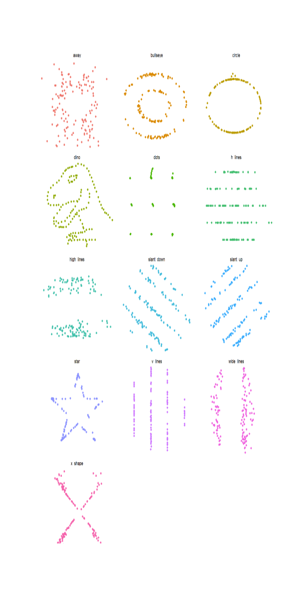<!-- -->

### Examining the summary of our data

Before we begin, we have to load in our data using read.csv and assign
this dataset to the dataframe title “Data”. This will make it easier to
use in our code throughout the tutorial. Once the data is loaded in, we
can look at the summary of our data. We use summarize() to find the mean
of x and y, the standard deviation of x and y, and the correlation
between x and y. We want to find the summary for each dataset, so we
will use group_by().

``` r
Data <- read.csv("datasaurus_data.csv")
Data |> 
  group_by(dataset) |> 
  summarize(
      mean_x    = mean(x),
      mean_y    = mean(y),
      std_dev_x = sd(x),
      std_dev_y = sd(y),
      corr_x_y  = cor(x, y))
```

    ## # A tibble: 13 × 6
    ##    dataset mean_x mean_y std_dev_x std_dev_y corr_x_y
    ##    <chr>    <dbl>  <dbl>     <dbl>     <dbl>    <dbl>
    ##  1 J         54.3   47.8      16.8      26.9  -0.0686
    ##  2 a         54.3   47.8      16.8      26.9  -0.0645
    ##  3 b         54.3   47.8      16.8      26.9  -0.0641
    ##  4 c         54.3   47.8      16.8      26.9  -0.0617
    ##  5 d         54.3   47.8      16.8      26.9  -0.0694
    ##  6 e         54.3   47.8      16.8      26.9  -0.0656
    ##  7 f         54.3   47.8      16.8      26.9  -0.0630
    ##  8 g         54.3   47.8      16.8      26.9  -0.0685
    ##  9 h         54.3   47.8      16.8      26.9  -0.0603
    ## 10 i         54.3   47.8      16.8      26.9  -0.0683
    ## 11 k         54.3   47.8      16.8      26.9  -0.0686
    ## 12 l         54.3   47.8      16.8      26.9  -0.0690
    ## 13 m         54.3   47.8      16.8      26.9  -0.0666

As we can see from the summary, each dataset has pretty much the same
mean and standard deviation for both x and y, and the same x-y
correlation. So we will have find other distinct characteristics of the
dinosaur dataset.

### Hint

As you can see from the scatter plots above, there are no gaps in our x
and y-values for our dinosaur as there are in ‘wide lines’ or ‘dots’
datasets. Additionally, the x-values of our dinosaur are normally
distributed while our y-values are not. The x variable has a minimum of
22.3 and a maximum of 98.2 and the y variable has a minimum of 2.9 and a
maximum of 99.4.

## Create Separate Dataframes

So we can easily visualize each dataset, we will create a new dataframe
from each dataset. The code below shows you how to create a new
dataframe for dataset “A”. Use the same code to create dataframes for
the rest of the datasets. Make sure the name of each lettered dataset is
a capital version of the letter of the dataset (i.e. A is associated
with”a”, B with “b”).

``` r
A <- Data |>
  filter(dataset == "a")
B <- Data |>
  filter(dataset == "b")
C <- Data |>
  filter(dataset == "c")
D <- Data |>
  filter(dataset == "d")
E <- Data |>
  filter(dataset == "e")
F <- Data |>
  filter(dataset == "f")
G <- Data |>
  filter(dataset == "g")
H <- Data |>
  filter(dataset == "h")
I <- Data |>
  filter(dataset == "i")
J <- Data |>
  filter(dataset == "J")
K <- Data |>
  filter(dataset == "k")
L <- Data |>
  filter(dataset == "l")
M <- Data |>
  filter(dataset == "m")
```

## Box Plots

First, we are going to visualize the data. We will start by making a box
plot for “x” variables with the following code. The \# removes the text
from the code. This is included to tell you what each line of code does.
Ideally, you should not have this in your code.

``` r
Data |> # selects dataframe you want to apply the following code to
  ggplot(aes(x = x)) + # ggplot is the package, aes() selects variables to plot
    geom_boxplot() + # we want to create a boxplot
    theme_void() # selects void theme for the plot
```

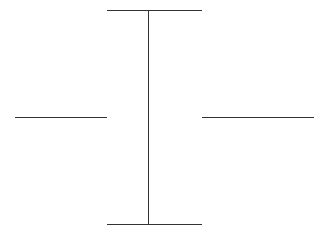<!-- -->

*What are some issues with this boxplot?*

1)  All x values are plotted together instead of by dataset

2)  No color

We will use the following code to make these changes.

``` r
Data |>
  ggplot(aes(x = x, colour = dataset)) + # "colour" color codes values by dataset
    geom_boxplot() +
    theme_void() +
    theme(legend.position = "none") + # removes legend
    facet_wrap(~dataset, ncol = 3) # creates separate plots for each dataset, ncol creates 3 columns
```

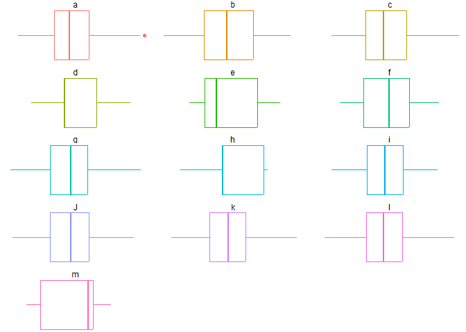<!-- --> This
looks much better and helps us visualize each individual dataset.

*How do we interpret these plots?* This data will show us if our data is
normally distributed. The middle line in each of these boxes represents
the median, while the ends of the boxes represent the 1st and 3rd
quartile. This shows where 50% of our data falls The ends of the
whiskers represent the our 95% intervals. This means 95% of our data
will fall in between these whiskers, unless we have some outliers. We
can see that “d”, “e”, “h”, and “m” are all skewed, as their medians are
quite close to their 1st or 3rd quartile respectively. In normally
distributed data, our median should fall in the middle of the box and
our whiskers should be even lengths. It might be harder to notice, but
“a” is skewed, not by median but by the 50%. We can see that we have an
outlier that is causing our upper whisker to be longer than the lower
whisker.

Now lets create the same plots for the y variable.

``` r
Data |>
  ggplot(aes(x = y, colour = dataset))+
    geom_boxplot()+
    theme_void()+
    theme(legend.position = "none")+
    facet_wrap(~dataset, ncol = 3)
```

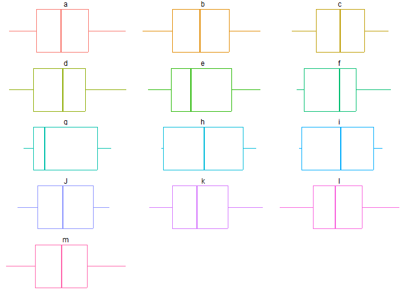<!-- --> This
data shows us the distribution of points along the y-axis for each plot.
You can see that there is a difference between these plots and those
previously, as far fewer of them are skewed. This tells us that a
dataset can be normal in one variable but not another.

## Hypothesis

*Based on what we know about the dinosaur dataset and its distribution,
can we rule out any datasets that could not be the dinosaur?*

*Which dataset do you think is the dinosaur?* Write down your
hypothesis. It is okay if you do not know, you should always formulate
your hypothesis before running tests anyways.

## Histograms

### X-axis

Now we are going to create different types of plots called
histograms.Histograms are a type of plot that can be used to visualize
the distribution of data. Rather than only displaying statistics such as
min, max, mean, 1st quartile and 3rd quartile, histograms shows all the
data in bins. Bins group similar values together and shows the count of
values in each bin. This allows us to pick up on things such as modes.

We can use similar code as the boxplots. We will use a different theme
here because it is important to show the x and y axis for this plot.

``` r
Data |> 
  ggplot() +
  aes(x = x, fill = dataset) +
  geom_histogram() + # selects histogram as plot
  facet_wrap(~dataset)+
  theme_cowplot() + # uses cowplot theme 
  theme(legend.position = "none")+
  xlab("X variable") + #changes x axis label
  ylab("Count") #changes y axis label
```

    ## `stat_bin()` using `bins = 30`. Pick better value with `binwidth`.

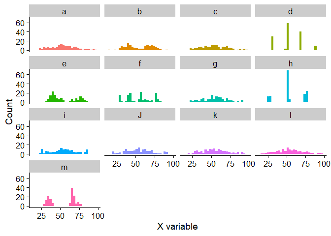<!-- -->

Looking at the histograms for the x variable, we can see in some groups,
there are multiple spikes in count at different values, having two
spikes is bimodal and multiple spikes is multimodal. For other groups,
the data looks more uniform and only has one spike, the is unimodal.

*We can also use this to visualize gaps in the data. Are there gaps in
the x values of our dinosaur?*

### Y-axis

``` r
Data |> 
  ggplot() +
  aes(x = y, fill = dataset) +
  geom_histogram() +
  facet_wrap(~dataset)+
  theme_cowplot()+
  theme(legend.position = "none")+
  xlab("Y Variable")+
  ylab("Count")
```

    ## `stat_bin()` using `bins = 30`. Pick better value with `binwidth`.

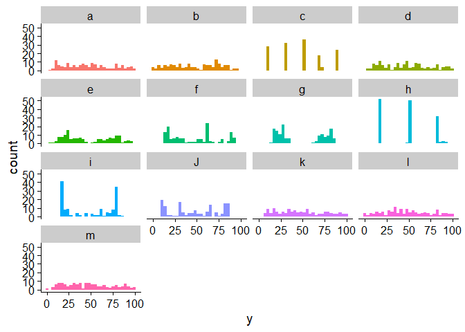<!-- -->

*Take a look at the histograms plotting the y variable for each dataset
Which datasets are unimodal, bimodal, and multimodal? What category best
described the y variable for our dinosaur?* *Can we rule out any
additional datasets after looking at these histograms?*

## Density Plots

We will create one more type of plot called density plots. Density plots
are similar to histograms in that it plots the distribution of values.
However, histograms shows the number of values in each bin, whereas
density plots show the proportion of values in each range. You can
conclude similar things from each plot, but sometimes it is easier to
visualize peaks and valleys in the data on a density plot.

Run the following code chunk for the x variable.

``` r
Data |> 
  ggplot() +
  aes(x = x,  fill = dataset) + 
  geom_density(alpha=.3) + # creates a density plot
  facet_wrap(~dataset)+
  theme_cowplot()+
  theme(legend.position = "none")+
  xlab("X Variable")+
  ylab("Density")
```

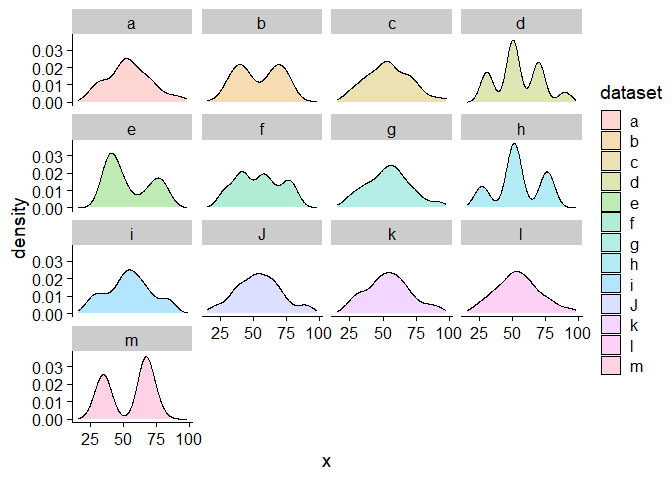<!-- -->

Use the same code above but modify it to create plots for the y
variable.

``` r
Data |> 
  ggplot() +
  aes(x = y,  fill = dataset) + 
  geom_density(alpha=.3) +
  facet_wrap(~dataset) +
  theme_cowplot()+
  theme(legend.position = "none")+
  xlab("Y variable")+
  ylab("Density")
```

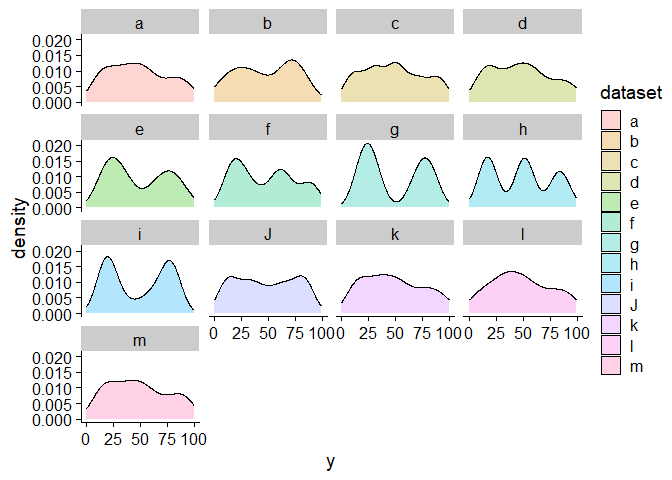<!-- -->

## Testing normality

Now that we have visualized the data, lets run some statistical tests.
Sometimes these tests can confirm what we already know from the
visualization, and other times its hard to conclude what our
visualization is showing. These tests can help clarify this.

In this section we will run Wilkes-Shapiro tests which test how normally
distributed your data is. Interpreting the results of a Wilkes-Shapiro
test can be tricky. In most statistical test, we want a p-value less
than 0.05 to determine significance. However, in a Wilkes-Shapiro test,
a p-value greater than 0.05 means the data is normally distributed.

We have provided an example of the code for dataset ‘M’. Now you try
running the same code for the rest of the datasets.

``` r
shapiro.test(M$x) #Test for normality of the x variable in dataset M
```

    ## 
    ##  Shapiro-Wilk normality test
    ## 
    ## data:  M$x
    ## W = 0.80157, p-value = 1.369e-12

``` r
shapiro.test(M$y) #Test for normality of the y variable in dataset M
```

    ## 
    ##  Shapiro-Wilk normality test
    ## 
    ## data:  M$y
    ## W = 0.95388, p-value = 0.0001111

## Models

Let’s try generalized linear modeling, this will tell you the Akaike
Information Criterion (AIC) values which tests for the relative success
of the model in explaining the relationship between a response variable
and one or more explanatory variables, a lower number being more
desirable. We will also run a Bayesian Information Criterion (BIC)
formula on the same linear model which tests the same things in a
similar but subtly different way. It is important to remember that these
values can only be compared to each other if you’re testing from within
the same dataset using different explanatory variables. You have been
given one formula as an example, and now you have to run the same for
the other datasets. Your target dataset has an AIC of -18.276 and a BIC
of -6.452445.

This code chunk also includes the code to create a Q_Q Residual Plot
along with a diagonal Q_Q line. This is meant to show the distribution
of the residuals of the linear model, which can be compared to this
diagonal line to determine the normality of the distribution of the
data. If the data points closely follow the line and maintain a
similarly straight distribution, then the data can be considered to
likely be normal. However, if it significantly deviates from the line or
is not a straight line, then it can be considered to likely be
non-normal.

``` r
Fglm = glm((y/x) ~ x + y, data = F) #This forms the model as a query to the correlative relationship of (y/x) to x and y
summary(Fglm) #This gives us a readout of that model we generated
```

    ## 
    ## Call:
    ## glm(formula = (y/x) ~ x + y, data = F)
    ## 
    ## Coefficients:
    ##               Estimate Std. Error t value Pr(>|t|)    
    ## (Intercept)  1.1448386  0.0757676   15.11   <2e-16 ***
    ## x           -0.0192596  0.0011536  -16.70   <2e-16 ***
    ## y            0.0186178  0.0007183   25.92   <2e-16 ***
    ## ---
    ## Signif. codes:  0 '***' 0.001 '**' 0.01 '*' 0.05 '.' 0.1 ' ' 1
    ## 
    ## (Dispersion parameter for gaussian family taken to be 0.05255264)
    ## 
    ##     Null deviance: 60.3320  on 141  degrees of freedom
    ## Residual deviance:  7.3048  on 139  degrees of freedom
    ## AIC: -10.377
    ## 
    ## Number of Fisher Scoring iterations: 2

``` r
BIC(Fglm) #This runs a Bayesian Information Criterion test on that model.
```

    ## [1] 1.446249

``` r
plot(qqnorm(residuals(Fglm)),qqline(residuals(Fglm))) #This creates a Q_Q residual plot of the linear model to represent data normality.
```

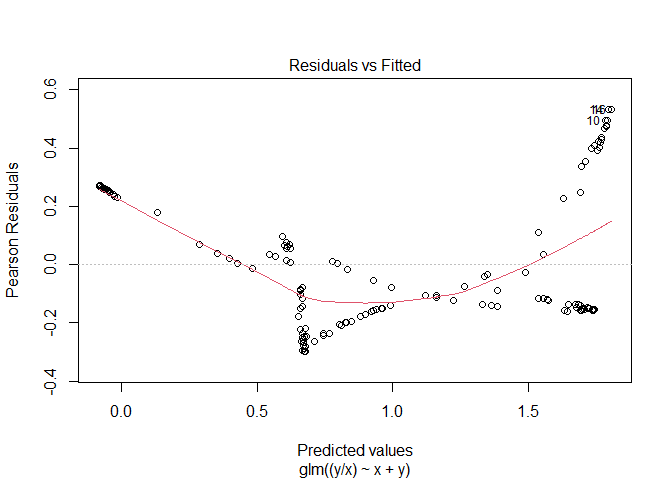<!-- -->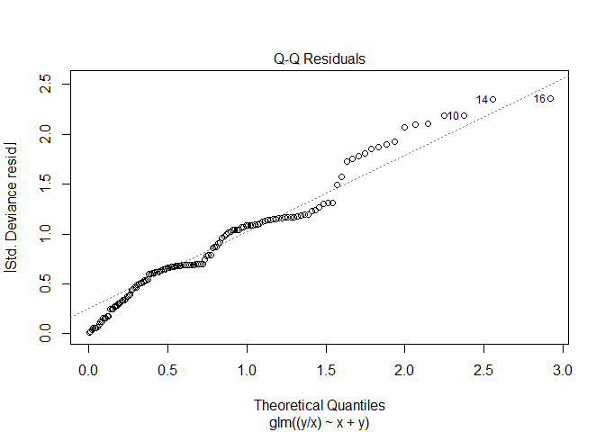<!-- -->
*Which model do you think is the dataset?*

*How do these models change if you only have one explanatory variable?
Why?*

## Conclusion

*After looking at the plots and statistical test, what dataset do you
think is the dinosaur? What lead you to this conclusion and what does
that say about the data?*

Running the following code chunk will generate a scatter plot that shows
the design of each dataset. This will reveal which dataset is the
dinosaur.

``` r
Data |> 
  ggplot(aes(x = x, y = y, colour = dataset))+
    geom_point()+
    theme_void()+
    theme(legend.position = "none")+
    facet_wrap(~dataset)
```

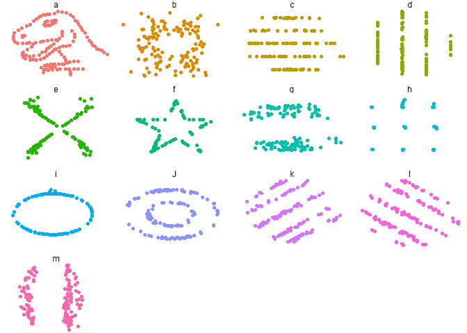<!-- -->

*Were you right? If not, what mislead you?*

## References

ChatGPT - “<https://chatgpt.com/c/66fc2c4d-71a0-800d-8cbc-1ae9a48dffb0>”
