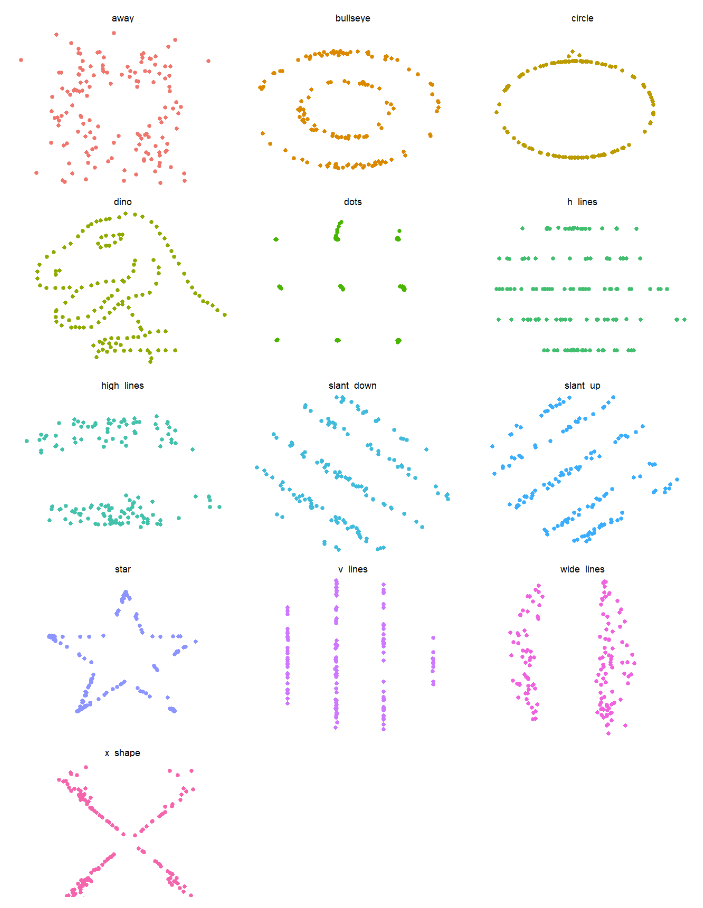

# Dinosaurus Data

Hello everyone, in this tutorial we will be showing you how to make graphs and do statistical tests on a variety of datasets. Today, we will be looking at a R package called Datasaurus. The purpose of it is to practice statistical tests to see how different types of plots can look different.

Before we begin, we must load in our packages to help us make our plots. Please copy this code so that you can make the same plots as us as well.


```{r}
# Load other packages here.
if (!require("tidyverse")) install.packages("tidyverse"); library(tidyverse)
options(warn = -1)
knitr::opts_chunk$set(echo = TRUE)
if (!require("UsingR")) install.packages("UsingR"); library(UsingR)
if (!require("cowplot")) install.packages("cowplot"); library(cowplot)
if (!require("car")) install.packages("car"); library(car) # Anova function for better lm summary stats
if (!require("multcomp")) install.packages("multcomp"); library(multcomp) # glht function for Tukey test
if (!require("emmeans")) install.packages("emmeans"); library(emmeans) # emmeans and pairs functions for post-hoc analysis
if (!require("conflicted")) install.packages("conflicted"); library(conflicted) # For dealing with conflicts
if (!require("tidyverse")) install.packages("tidyverse"); library(tidyverse) # For everything
conflict_prefer_all("dplyr", quiet = TRUE)
library(ggplot2)
```

### Plot visualization
Now that we have installed packages, we can visualize all of our plots from the datasaurus dataset. As you can see, the dataset has a variety of different types of plots. We have circular plots, linear plots, and ones with cool shapes. We will be going through our dataset to narrow down the possible types of plots until we have eliminated all but the dinosaur plot.



### Examining the summary of our data
Lets take a look at Summary of the different types of plots in our dataset. To make this challenge as fun as possible, we have given each type of plot a letter to represent it.
```{r}

Data <- read.csv("dinosaurus_dozen_clean.csv")
Data |> 
  group_by(dataset) |> 
  summarize(
      mean_x    = mean(x),
      mean_y    = mean(y),
      std_dev_x = sd(x),
      std_dev_y = sd(y),
      corr_x_y  = cor(x, y)
      )

A <- Data |>
  filter(dataset == "a")
B <- Data |>
  filter(dataset == "b")
C <- Data |>
  filter(dataset == "c")
D <- Data |>
  filter(dataset == "d")
E <- Data |>
  filter(dataset == "e")
F <- Data |>
  filter(dataset == "f")
G <- Data |>
  filter(dataset == "g")
H <- Data |>
  filter(dataset == "h")
I <- Data |>
  filter(dataset == "i")
J <- Data |>
  filter(dataset == "j")
K <- Data |>
  filter(dataset == "k")
L <- Data |>
  filter(dataset == "l")
M <- Data |>
  filter(dataset == "m")

```


In this section you have been given one example formula for generating a Wilkes-Shapiro test which is meant to test for normality. You are to run this test on every other dataset to determine which one is your target dataset. The target dataset has a P-value for it's Xs of 0.118 and a W value of 0.98479. for its Ys, 0.0001252 and 0.95449 respectively. What do these values tell you and why?

```{r}
shapiro.test(M$x)
shapiro.test(M$y)
```
The table above shows statistics such as mean median, and standard deviation of the X and Y coordinates for each plot. Because we have shuffled the names of the plots, we can use this sort of information to identify the dinosaur plot.

<<<<<<< HEAD

Let's try generalized linear modeling, this will tell you the Akaike Information Criterion values which tests for the relative success of the model in explaining the relationship between a response variable and one or more explanatory variables. We will also run a Bayesian Information Criterion formula on the same linear model which tests the same things in a similar but subtley different way. It is important to remember that these values can only be compared to each other if you're testing from within the same dataset using different explanatory variables. You have been given one formula as an example, and now you have to run the same for the other datasets. Your target dataset has an AIC of 1383 and a BIC of 1394.847
```{r}
Fglm = glm(X ~ x + y, data=F)
summary(Fglm)
BIC(Fglm)

```


=======
## Boxplots
### X-axis
>>>>>>> 30337724e3522b0ea06d5dba6b919f2a31d0f685
```{r}
Data |>
  ggplot(aes(x = x, colour = dataset)) +
    geom_boxplot() +
    theme_void() +
    theme(legend.position = "none") +
    facet_wrap(~dataset, ncol = 3)
```
This data will show us how skewed our data is. The middle line in each of these boxes represents the mean, while the ends of the boxes represent the 1st and 3rd quartile. The ends of the whiskers represent the minimum and maximum. We can see that "d", "e", "h", and "m" are all skewed, as their means are quite close to their 1st or 3rd quartile respectively.

### Y-axis
```{r}
Data |>
  ggplot(aes(x = y, colour = dataset))+
    geom_boxplot()+
    theme_void()+
    theme(legend.position = "none")+
    facet_wrap(~dataset, ncol = 3)
```
This data shows us the distribution of points along the y-axis for each plot. You can see that there is a difference between these plots and those previously, as far fewer of them are skewed. This tells us that a dataset can be normal in one variable but not another.

## Histograms
### X-axis
```{r}
Data |> 
  ggplot() +
  aes(x = x, color = dataset, fill = dataset) +
  geom_histogram() +
  facet_wrap(~dataset)+
  theme_cowplot()
```
### Y-axis
```{r}
Data |> 
  ggplot() +
  aes(x = y, color = dataset, fill = dataset) +
  geom_histogram() +
  facet_wrap(~dataset)+
  theme_cowplot()
```
### Analysis
Historgrams are a type of plot that can be used to visualize the distribution of data. Rather than only displaying statistics such as min, max, mean, 1st quartile and 3rd quartile, historgrams bin data based on smaller ranges. This allows us to pick up on things such as modes. In this case, "e", "g", "m" and "i" are bimodal, and "d", "f", "h", and "j" are multi modal. 


*Descriptions of statistical tests*
Shapiro-Wilks test: this test is used to 


```{r}
Data |> 
  ggplot() +
  aes(x = x,  fill = dataset) + 
  geom_density(alpha=.3) +
  facet_wrap(~dataset)
  theme_cowplot()
```

```{r}
Data |> 
  ggplot() +
  aes(x = y,  fill = dataset) + 
  geom_density(alpha=.3) +
  facet_wrap(~dataset)
  theme_cowplot()
```

```{r}
Data |> 
  ggplot(aes(x = x, y = y, colour = dataset))+
    geom_point()+
    theme_void()+
    theme(legend.position = "none")+
    facet_wrap(~dataset)
```

